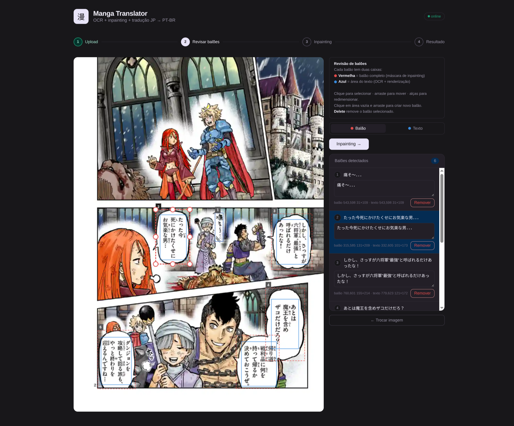
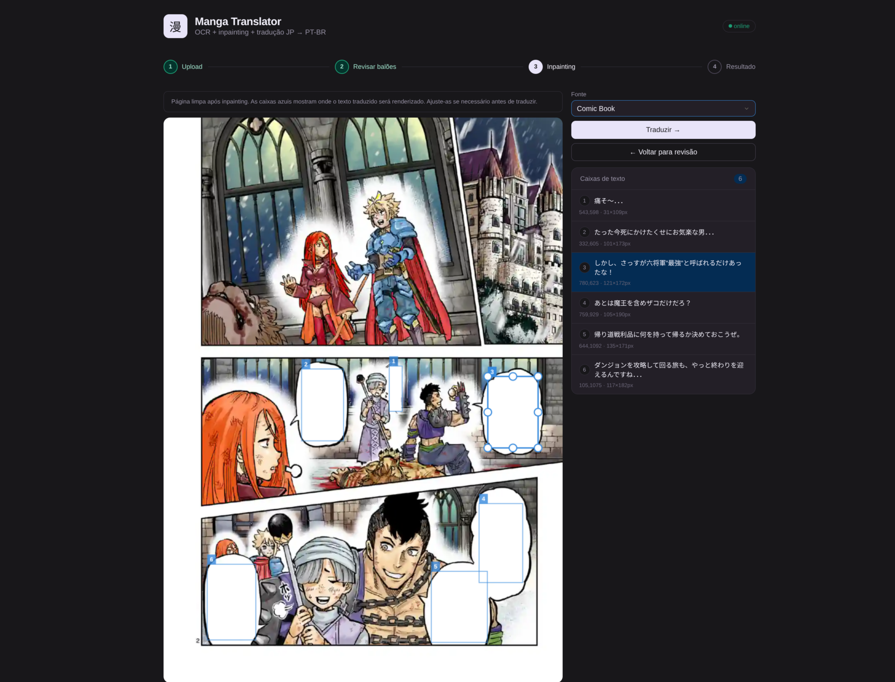
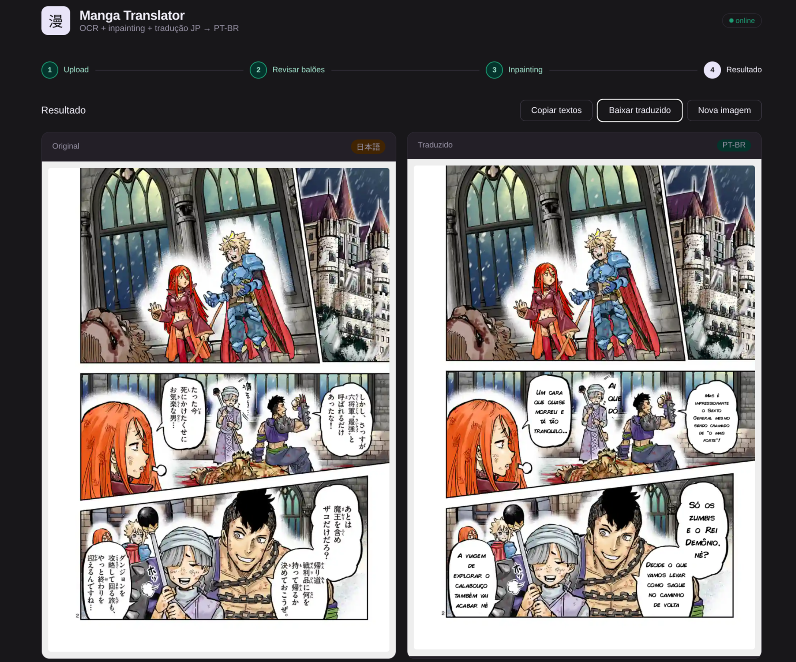

# 漫画 Mangalator

A simple, local, self-hosted pipeline for translating Japanese manga pages into Portuguese (PT-BR). Upload a page, review the detected speech balloons, inpaint the original text, and render the translation — all in a browser-based UI backed by a FastAPI server running entirely on your machine.

---

## Features

- **Automatic bubble detection** via a fine-tuned [RT-DETR-v2](https://huggingface.co/ogkalu/comic-text-and-bubble-detector) model — detects both the full balloon outline and the tight text region inside it
- **Japanese OCR** using [manga-ocr](https://github.com/kha-white/manga-ocr), a transformer model optimised for stylised manga fonts and vertical text, with EasyOCR as automatic fallback
- **Text erasure** via a dependency-free flood-fill inpainter — seeds from inside the balloon, maps the white interior, and row-span fills through text strokes without touching the black border
- **Translation rendering** with auto-fitted text inside the tight text box, custom font support, and automatic word-wrap and font-size scaling (still need some work)
- **4-step interactive UI** — each stage is editable before advancing:
  1. Upload a manga page (PNG, JPG, WEBP)
  2. Review and adjust both bounding boxes per balloon (balloon mask + text region), correct OCR text
  3. Preview the inpainted page and fine-tune text box placement
  4. View, download, and copy the final translated page
- **Dual bounding-box model** — every balloon carries a *bubble box* (used as the inpaint region) and a *text box* (used for OCR crop and translation rendering), both independently editable on the canvas
- **Custom font** — drop any `.ttf` or `.otf` into `fonts/` and it will be used automatically on the next server start
- **Fully local** — OCR, detection, inpainting, and translation all run on your machine via Ollama; no data leaves your network

---

## Stack

| Layer | Technology |
|---|---|
| Backend | Python · FastAPI · Pillow · NumPy |
| Detection | Hugging Face Transformers · RT-DETR-v2 |
| OCR | manga-ocr (primary) · EasyOCR (fallback) |
| Inpainting | Custom flood-fill (no ML model) |
| Translation | Ollama · Gemma 4 (`gemma4:e4b`) |
| Frontend | Vanilla JS · HTML Canvas · CSS |

---

## Project structure

```
.
├── main.py          # FastAPI app — all endpoints
├── detector.py      # RT-DETR-v2 bubble + text-region detection
├── ocr.py           # manga-ocr / EasyOCR wrapper
├── inpainter.py     # Flood-fill text eraser
├── translator.py    # Ollama/Gemma 4 translation (JP → PT-BR)
├── fonts/           # Drop .ttf / .otf files here
└── static/
    ├── index.html
    ├── app.css
    └── app.js
```

---

## Setup

**Requirements:** Python 3.10+, [uv](https://docs.astral.sh/uv/), CUDA 12.4 (GPU recommended), ~3 GB disk

### 1. Install uv

```bash
curl -LsSf https://astral.sh/uv/install.sh | sh
```

### 2. Clone and install

```bash
git clone https://github.com/you/mangalator
cd mangalator
uv sync          # reads pyproject.toml, creates .venv, installs everything
```

PyTorch is pulled from the CUDA 12.4 index automatically — no manual `pip install torch` needed.

> **CPU-only machine?** Remove the `[tool.uv.sources]` and `[[tool.uv.index]]` blocks from `pyproject.toml` before running `uv sync`. PyTorch will fall back to the CPU build from PyPI.

### 3. Pull the Ollama model

```bash
# Install Ollama if you haven't already
curl -fsSL https://ollama.com/install.sh | sh

ollama pull gemma4:e4b
```

### 4. (Optional) Add a custom font

```bash
cp MyFont.ttf fonts/
```

### 5. Run

```bash
uv run main.py
# → http://localhost:8000
```

Model weights are downloaded automatically on first use:
- RT-DETR-v2 detector (~300 MB, via Hugging Face)
- manga-ocr (~400 MB, via Hugging Face)

---

## Translation — Ollama + Gemma 4

Translation is handled locally by [Ollama](https://ollama.com) running the `gemma4:e4b` model.  No internet access or API key is required — the model runs entirely on your machine.

### Install Ollama and pull the model

```bash
# Install Ollama (macOS / Linux)
curl -fsSL https://ollama.com/install.sh | sh

# Pull the model (one-time download, ~5 GB)
ollama pull gemma4:e4b
```

The `ollama` Python client is already included in `pyproject.toml` and installed by `uv sync`.

### Start Ollama before running the server

```bash
ollama serve             # keep this running in a separate terminal
uv run python main.py    # then start the FastAPI server
```

The translator sends each OCR'd bubble to Gemma 4 with a localisation-focused system prompt that enforces:

- Brazilian Portuguese output only, no labels or explanations
- Informal register (`você`, gírias) unless the source is clearly formal/keigo
- Onomatopoeia adapted to PT-BR equivalents rather than translated literally
- Honorifics (`-san`, `-kun`, etc.) kept only when no natural PT-BR equivalent exists
- Shorter phrasing preferred to fit the spatial constraints of the speech bubble
- Temperature `0.3` for consistent, deterministic output

### Switching to a different model or backend

Change `_MODEL` at the top of `translator.py` to use any model available in your Ollama installation, or replace `translate_text()` entirely with any other backend (DeepL, OpenAI, argostranslate, etc.):

```python
# translator.py
_MODEL = "llama3.1:8b"   # or any other ollama model

# — or swap the whole function —
def translate_text(japanese: str) -> str:
    return your_other_backend(japanese)
```

---

## How the inpainter works

The flood-fill eraser needs no ML model and no internet access:

1. Crop the text bounding box from the image
2. Find a white seed pixel (tries the centre first, then searches outward)
3. BFS flood-fill through pixels above the white threshold — the black balloon border acts as a natural wall
4. For each row, paint everything between the leftmost and rightmost filled pixel white — this covers text strokes that interrupted the fill without touching the border

---

## Examples





---

## Roadmap

- [ ] Try japanese specific translation models
- [ ] Try fine tunning gemma4 for translation
- [ ] Vertical text rendering for SFX
- [ ] Batch mode (process a full chapter at once)
- [ ] Export as CBZ

---

## License

MIT
